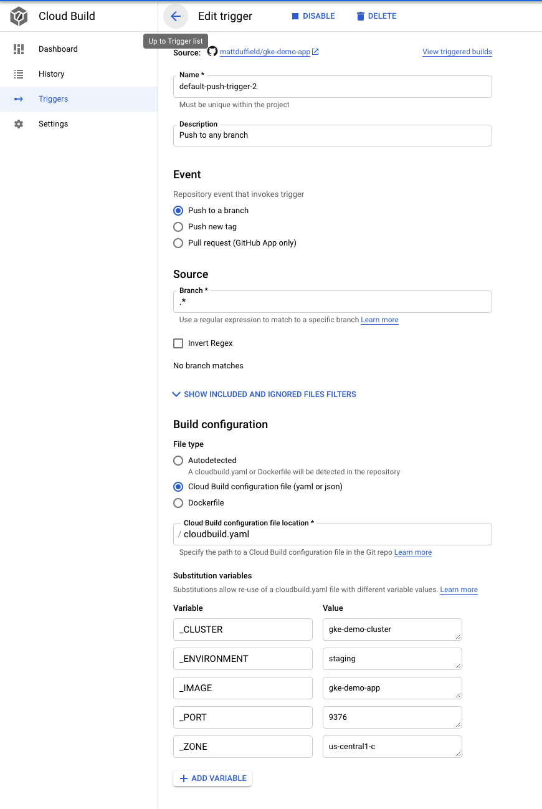

# gke-demo-app
This repository demonstrates using Kubernetes and Container-Native Load Balancer. The application will be written in NodeJS. We will be using CloudBuild with some environment variables to make things easier and facilitate multiple project environments, e.g. Staging or Production.

# GCP Setup
This repository assumes that you have a project running.


## Deployment
The following are steps to create a cluster and provision it for Container-Native Load Balancing

### Configuration and settings

In order to be sure you are on the correct Project, execute the following:
`gcloud config configurations list`

To change the current project to staging, executing the following:
`gcloud config set project <project-name>`

If you experience timeout errors while trying to execute commands, you will need to ensure that the credentials are pointing to the correct cluster and zone.
`gcloud container clusters get-credentials gke-demo-cluster --zone us-central1-c`

### Create a Cluster

To create a cluster, execute the following command:
`gcloud container clusters create gke-demo-cluster --enable-ip-alias --enable-autoscaling --num-nodes 1 --min-nodes 1 --max-nodes 5 --create-subnetwork="" --network=default --zone=us-central1-c`

You will need to update credentials by executing the following (if you have multiple clusters, this step is crucial so that you are working against the correct cluster):
`gcloud container clusters get-credentials gke-demo-cluster --zone us-central1-c`

### Setup CloudBuild with Environment variables
We will be using environment variables to facilate deploying our application. By using these variables, we can make our `cloudbuild.yaml` and other service files dynamic.



Be sure to add the following variables to your Cloud Build trigger:

Variable     | Value
---          | ---
_CLUSTER     | gke-demo-cluster
_ENVIRONMENT | staging
_IMAGE       | gke-demo-app
_PORT        | 9376
_ZONE        | us-central1-c


It is possible to change any of these values to what you want. Just be sure to update the cloudbuild.yaml file. Most of the YAML files have some placeholders that need to be replaced during the build process.

### Commit your changes
You are now ready to test your application! 

Simply commit and push your changes to trigger Cloud Build.

If this is the first time you are committing, the build could take a while. Also, you will find that the creation of the Ingress can from 5-10 mintutes.

### Help

Count number of distinct responses
```
for i in `seq 1 100`; do curl --connect-timeout 1 -s <ip address> && echo; done  | sort | uniq -c
```

To verify that the Ingress service is working, execute the following command:
`kubectl describe ingresss <ingress-name e.g. gke-demo-ing>`

To SSH into a given POD
`kubectl exec -it <pod e.g. gke-demo-86cd9f85f8-qmbmr> -- sh`

